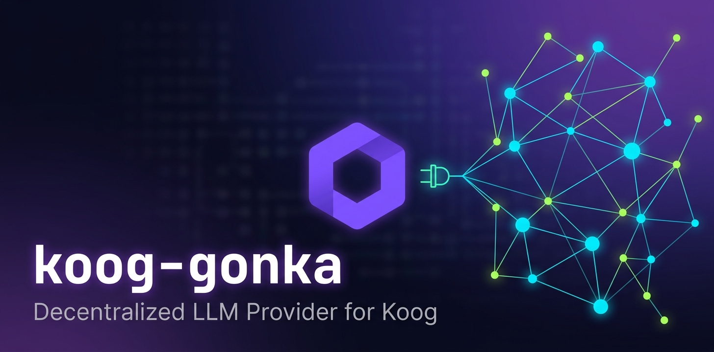

= koog-gonka

image:https://img.shields.io/badge/Kotlin-2.3.10-7F52FF.svg?logo=kotlin&logoColor=white[Kotlin 2.3.10,link=https://kotlinlang.org]
image:https://img.shields.io/badge/JDK-17+-ED8B00.svg?logo=openjdk&logoColor=white[Java 17+,link=https://adoptium.net]
image:https://img.shields.io/github/license/betschwa/koog-gonka[Apache 2.0,link=https://github.com/betschwa/koog-gonka/blob/master/LICENSE]

A https://docs.koog.ai/[Koog] `LLMClient` implementation for
https://gonka.ai[Gonka] — a decentralized, blockchain-based AI compute
network (Cosmos SDK L1 chain, native token GNK).

`koog-gonka` lets any Koog-based Kotlin project use Gonka as a regular LLM
provider, on equal footing with OpenAI, Anthropic, Google, Mistral, or
Ollama — through Koog's standard `LLMClient` abstraction.

== Status

Early development. No release yet.

== Authentication

Two auth modes are planned, both behind the same client interface:

* *API key via Gonka Broker* (first wave) — OpenAI-compatible endpoint,
  classic USD card billing, no wallet required.
* *Wallet-based direct chain access* (later wave) — secp256k1 request
  signing against the Gonka chain, no centralized broker layer.

== Coordinates

[source,kotlin]
----
dependencies {
    implementation("de.betchvaia:koog-gonka:<version>")
}
----

Not yet published to Maven Central.

== License

Apache License 2.0 — see link:LICENSE[].
